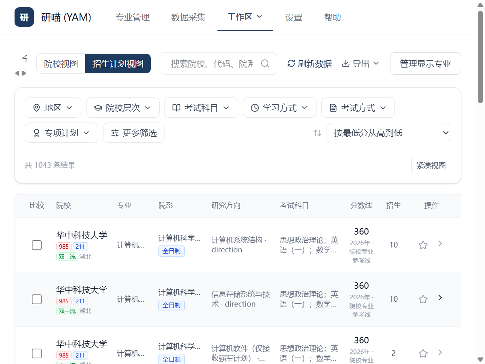
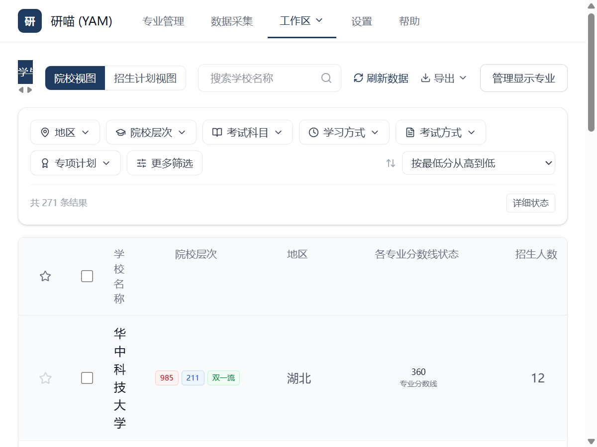
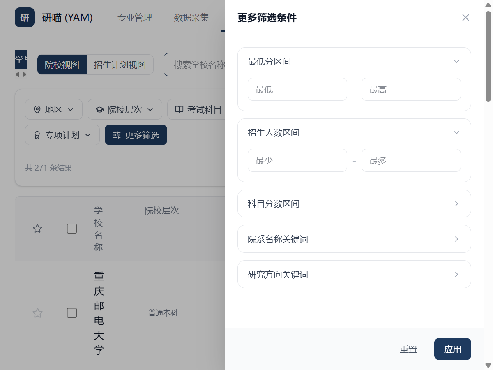
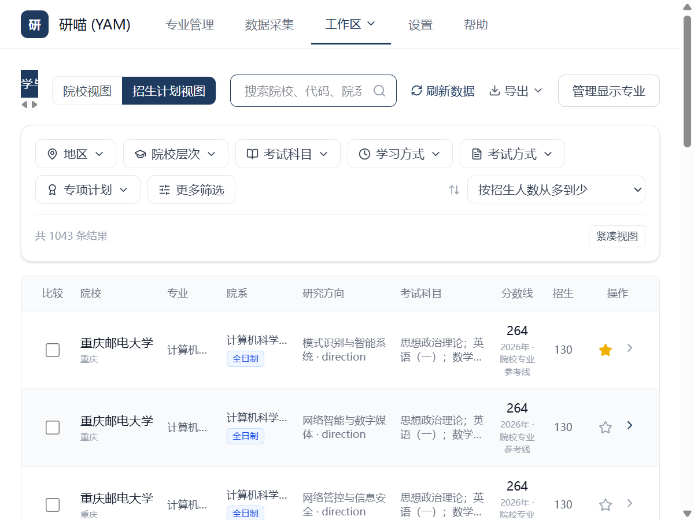
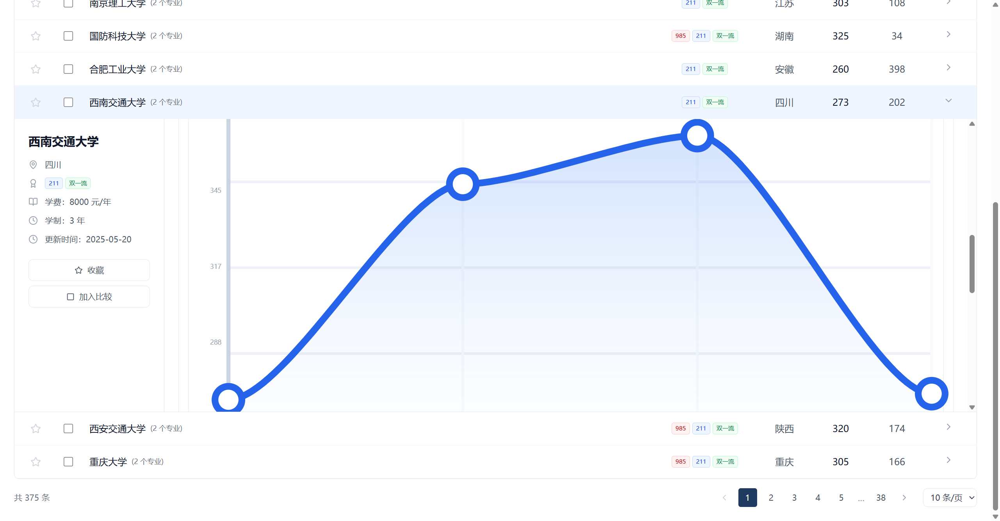
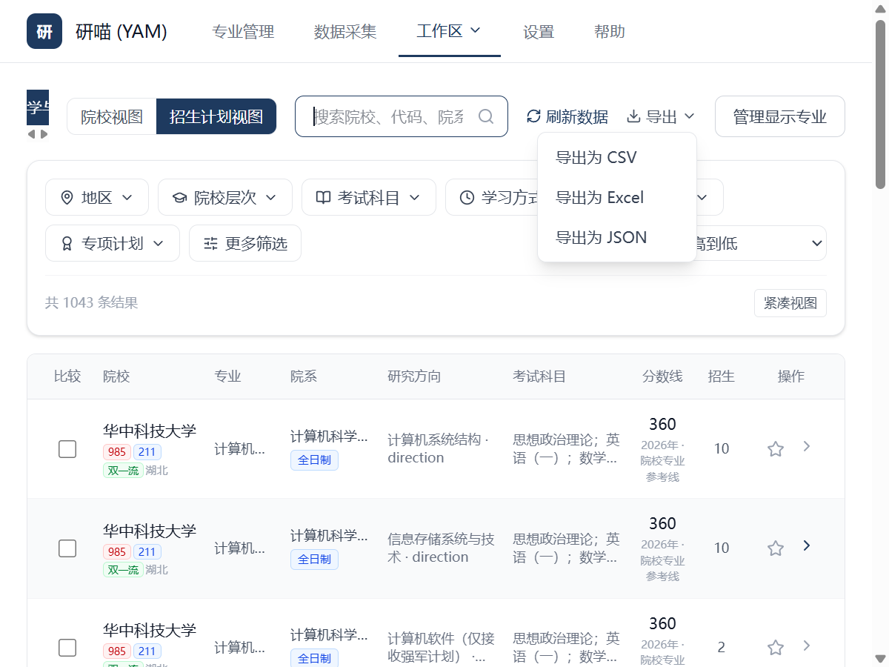

# 研喵 YAM

一款面向考研择校场景的 Windows 桌面工具，帮助你在本地整理院校、专业、研究方向、招生计划和分数线数据，并通过工作区进行筛选、对比与导出。

数据、登录状态和运行日志默认保存在你的电脑上，不会自动上传。

## 下载与安装

前往 [GitHub Releases](https://github.com/C-Y-T-258/yam/releases/latest) 下载最新版。

| 文件 | 适用场景 |
| --- | --- |
| `YAM-Setup-*.exe` | 推荐，大多数 Windows 用户直接安装 |
| `YAM-Setup-*.msi` | 适合需要 MSI 部署的环境 |
| `YAM-Portable-*.exe` | 免安装使用，需要系统已有 WebView2 Runtime |

下载后可使用 Release 页面提供的 `checksums.txt` 或对应 `.sha256` 文件校验安装包。

### 系统要求

- Windows 10 或 Windows 11
- Microsoft Edge 与 WebView2 Runtime
- 可访问相关公开数据来源的网络环境

安装版会在缺少 WebView2 时调用官方 bootstrapper；便携版不会自动安装 WebView2。应用已内置 Python 采集后端，用户无需另外安装 Python、Node.js 或 Rust。

## 可以做什么

- 在应用内完成登录状态管理和公开数据采集。
- 按院校、专业和研究方向组织择校信息。
- 查看招生计划、分数线证据和历年趋势。
- 对不同院校或专业进行筛选、收藏和对比。
- 将工作区数据导出为 CSV、Excel 或 JSON。
- 明确展示来源未知或暂不可得的数据，不使用猜测值替代。
- 在本地保存数据库、Cookie、运行时文件和诊断日志。

## 功能界面

研喵把院校、专业、研究方向、招生计划和分数线集中在一个本地工作区中，支持筛选、排序、收藏、趋势查看和数据导出。

### 工作区

按地区、院校层次、考试科目、学习方式等条件浏览院校专业，并快速切换院校视图和招生计划视图。



### 院校筛选

使用关键词、分数线、招生人数和院系/研究方向条件组合筛选结果。





### 招生计划与研究方向

查看专业代码、院系、研究方向、考试科目、分数线和招生人数等信息。



### 历史趋势与导出

展开院校记录查看分数线趋势，并将当前结果导出为 CSV、Excel 或 JSON。





## 开始使用

1. 从 [Releases](https://github.com/C-Y-T-258/yam/releases/latest) 下载安装版或便携版。
2. 启动 YAM，根据应用内提示完成登录状态检查。
3. 选择需要的数据范围并开始采集，等待后台任务完成。
4. 在工作区中按院校、专业、研究方向和年份浏览或对比数据。
5. 将需要保存的数据导出为 CSV、Excel 或 JSON。

如果采集失败，请先检查网络和登录状态。应用内诊断日志可以帮助定位问题，但提交问题前请确认日志中不包含个人信息。

## 数据与隐私

YAM 采用本地优先设计：

- 数据库：`%USERPROFILE%\.yam\data\yam-desktop.db`
- Cookie 与会话：`%USERPROFILE%\.yam\cookies\`
- 内置运行时：`%USERPROFILE%\.yam\runtime\`
- 日志和临时文件：`%USERPROFILE%\.yam\`

应用不会自动上传这些数据。当前也没有默认启用的远程错误上报功能。

## 使用限制

- 数据来自公开渠道，可能受来源网站更新、登录状态、网络环境和页面结构变化影响。
- 部分年份或字段可能无法从来源中可靠获得，应用会显示为未知，而不是推断或补造。
- 分数线、招生人数和研究方向等信息应结合招生单位发布的正式文件复核。
- 本项目提供的信息仅供学习和择校参考，不构成报考建议。

## 参与开发

普通用户不需要执行本节命令。

开发环境需要 Node.js 22、Python 3.12 和 Rust stable。首次准备环境：

```powershell
cd D:\yam
pip install -e .
npm --prefix yam-desktop ci
```

启动 Tauri 桌面端：

```powershell
npm --prefix yam-desktop run desktop:dev
```

常用验证命令：

```powershell
npm --prefix yam-desktop run test:ui
npm --prefix yam-desktop run test:types
npm --prefix yam-desktop run test:unit
npm --prefix yam-desktop run test:release:auto
```

发布前检查与 Windows 构建：

```powershell
npm --prefix yam-desktop run release:dry-run
npm --prefix yam-desktop run release:build
```

推送与项目版本一致的 `v<semver>` tag 会触发 Windows Release 工作流，并生成安装包、便携版、发布说明和 SHA-256 校验文件。

## 项目文档

- [发布说明](docs/release/RELEASE-NOTES.md)
- [路线图](docs/roadmap.md)
- [已知问题](docs/known-issues.md)
- [开发进度](docs/progress.md)
- [技术债务](docs/tech-debt.md)
- [数据采集设计记录](docs/data-collection-handoff-prompt.md)
- [登录与任务状态机设计](docs/session-handoff.md)

## 免责声明

数据来自公开渠道，仅供学习参考，不保证完全准确。使用本工具产生的任何决策及后果由使用者自行承担。

